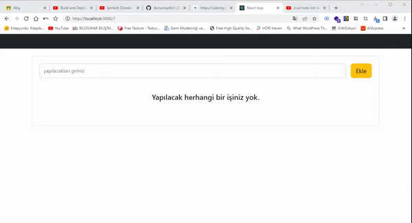

<h1>CRUD - Todo App</h1>

<h3>React ile dinamik bir Todo uygulaması geliştirildi</h3>

<h4>Kullanılan Teknolojiler</h4>
<h4>React - Html - Css</h4>

    *React ile bir Todo uygulamasının görsel ve dinamik olarak tasarımı yapıldı  
    * <b>Ekle </b> butonu ile input içerisindeki veri todo list e ekleniyor  
    * <b>Todo List </b> içerisinde listelenen içerikler <b>Sil - Düzenle - Yapıldı</b> butonlarındaki seçilen işlemlere göre dinamiklik kazandırıldı  
    *<b>Sil</b> butonu tıklandığında listedeki seçili id li görev listeden çıkartılıyor ve silindiğini belirten bir uyarı alınıyor  
    *<b>Düzenle</b> butonu tıklandığında listedeki seçili id li görev içeriği yeni açılan pencerede değiştirilip kaydet ve iptal seçeneklerine göre işlemler yapıldı, işlem sonucunu bildiren bir uyarı mesajı alınıyor  
    *<b>Yapıldı</b> seçeneğine tıklandığında seçili görev üzerinde stil değiştirilerek başlık üzeri çizgi ekleniyor ve buton içeriği <b>Yapılacak</b> olarak güncelleniyor  
    *

<a href="https://crud-react-todo.netlify.app/">Canlı Önizleme</a>

